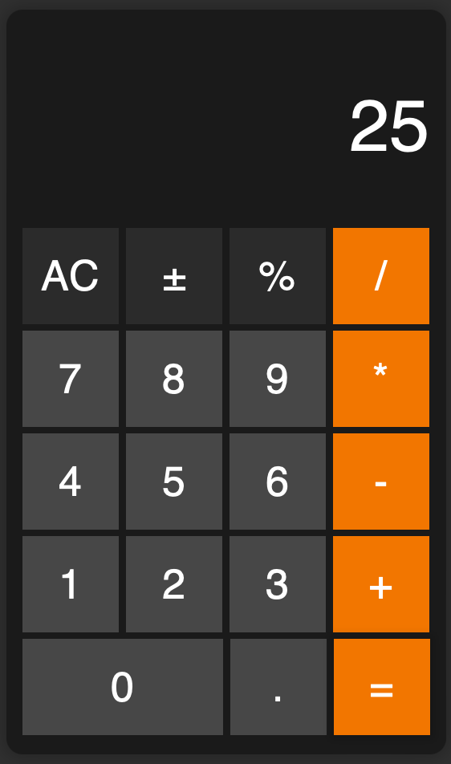

# iOS Theme Calculator

Welcome to the iOS Theme Calculator project! This simple calculator app is designed with an iOS-inspired theme, providing a familiar and user-friendly interface for basic arithmetic operations.

## Features

- Clean and intuitive iOS-themed user interface.
- Support for addition, subtraction, multiplication, and division.
- Responsive design for all web devices.

## Tutorial

In this tutorial, we are going to learn how to make a simple calculator with HTML, CSS and Javascript.

### Step 1: HTML Structure
Create the basic elements for html head tag and add the following to the page body.
```html
<div class="container">
        <div class="calculator">
            <form>
                <div class="display">
                    <input type="text" name="display" disabled>
                </div>
                <div>
                    <input type="button" value="AC" class="ac-btn">
                    <input type="button" class="plus-or-minus-btn" value="±">
                    <input type="button" class="percentage-btn" value="%">
                    <input type="button" class="symbols" value="/">
                </div>
                <div>
                    <input type="button" class="numpad-btns" value="7">
                    <input type="button" class="numpad-btns" value="8">
                    <input type="button" class="numpad-btns" value="9">
                    <input type="button" class="symbols" value="*">
                </div>
                <div>
                    <input type="button" class="numpad-btns" value="4">
                    <input type="button" class="numpad-btns" value="5">
                    <input type="button" class="numpad-btns" value="6">
                    <input type="button" class="symbols" value="-">
                </div>
                <div>
                    <input type="button" class="numpad-btns" value="1">
                    <input type="button" class="numpad-btns" value="2">
                    <input type="button" class="numpad-btns" value="3">
                    <input type="button" class="symbols" value="+">
                </div>
                <div>
                    <input type="button" class="numpad-btns zero-btn" value="0">
                    <input type="button" class="numpad-btns" value=".">
                    <input type="button" value="=" class="symbols">
                </div>
            </form>
        </div>
    </div>
```

### Step 2: CSS Styling
For the style, I made mine look like the ios calculator with the colors, buttons and borders. You can change yours according to your style.
```CSS
@charset "utf-8";
@import url("https://candyfonts.com/wp-data/2018/10/26/11538/HELR45W.ttf");

/* *** Root colors and font for ios style calucator *** */
:root {
    --main-font: 'helvetica', sans-serif;
    --primary-color: rgba(0, 0, 0, 0.753);
    --secondary-color: rgb(35, 35, 35);
    --button-bg-color: rgb(89, 89, 89);
    --special-button-color: rgb(57, 57, 57);
    --hover-shadow-color: rgba(0, 0, 0, 0.145);
}

/* *** Root Styles ***  */
* {
    margin: 0;
    padding: 0;
    box-sizing: border-box;
    user-select: none;
    font-family: var(--main-font);
}

body {
    height: 100vh;
    background: var(--primary-color);
}

.container {
    width: 100%;
    height: 100%;
    margin-inline: auto;
    display: flex;
    justify-content: center;
    align-items: center;
}

/* *** Common calculator style  ***  */

.calculator {
    background: var(--secondary-color);
    padding: 10px;
    box-shadow: 0 0 10px 3px rgba(0, 0, 0, 0.219);
    border-radius: 10px;
}

.calculator form input {
    border: 0;
    outline: 0;
    width: 60px;
    height: 60px;
    font-size: 26px;
    color: white;
    cursor: pointer;
    margin: 2px 0px;
}

.calculator form input.zero-btn {
    width: 125px;
}

.calculator form input.numpad-btns {
    background: var(--button-bg-color);
}

form .display {
    display: flex;
    justify-content: flex-end;
    margin: 20px 0;
}

form .display input {
    text-align: right;
    flex: 2;
    font-size: 45px;
    background: var(--display-bg-color);
    height: 80px;
    color: white;
}

form input.ac-btn, form input.plus-or-minus-btn, form input.percentage-btn {
    background: var(--special-button-color);
}

.symbols {
    background-color: #fa8c00;
}

.calculator form input:hover {
    box-shadow: 0 0 5px 3px var(--hover-shadow-color);
}
```
I highlighed the basic styles used. Change yours according to your preference.

### Step 3: JavaScript logic
JavaScript does all the calculation and listens to know the particular operation the user is performing at the particular time. I acheive that with a simple condition statement in an event listener. See code below;
```JavaScript
document.addEventListener('DOMContentLoaded', function() {
    const display = document.querySelector('[name="display"]');
    const buttons = document.querySelectorAll('input[type="button"]');

    buttons.forEach(button => {
        button.addEventListener('click', function() {
            const value = this.value;
            if (value === 'AC') {
                display.value = '';
            } else if (value === '±') {
                display.value = (display.value * -1);
            } else if (value === '=') {
                display.value = eval(display.value);
            } else if (value === '%') {
                display.value = (display.value / 100);
            } else {
                display.value += value;
            }
        });
    });
});
```

## Installation

1. Clone this repository to your local machine:

```bash
git clone https://github.com/matineno/mini-calculator.github.io.git
```

2. Open the project folder in VSCode.

3. Build and run the project on your device.

## Usage

1. Launch the iOS Theme Calculator app on your device.

2. Perform calculations using the familiar arithmetic buttons (+, -, *, /).

3. View the result displayed on the screen.

4. Clear the input by tapping the "C" button.

## Demo

[Click here](https://matineno.github.io/mini-calculator/) to test your application

## Screenshot



## Contributing

Contributions are welcome! If you'd like to contribute to this project, please follow these steps:

1. Fork the repository.

2. Create a new branch (`git checkout -b feature/your-feature-name`).

3. Commit your changes (`git commit -am 'Add some feature'`).

4. Push to the branch (`git push origin feature/your-feature-name`).

5. Create a new Pull Request.

## License

This project is licensed under the MIT License - see the [LICENSE](LICENSE) file for details.
